# Classless CSS

This is a list of CSS frameworks/themes that do not require you to add classes specific to them to your HTML elements.  It means you can quickly style a plain HTML page.  This is useful, for example, in prototyping.

## Contents

* [attriCSS](#attricss)
* [Bahunya](#bahunya)
* [LatexCSS](#latexcss)
* [Milligram](#milligram)
* [sakura](#sakura)
* [tacit](#tacit)
* [W3C Core Styles](#w3c-core-styles)
* [water.css](#watercss)
* [License](#license)

## attriCSS

* [Repository](https://github.com/raj457036/attriCSS)
* [Demo](https://raj457036.github.io/attriCSS/)

[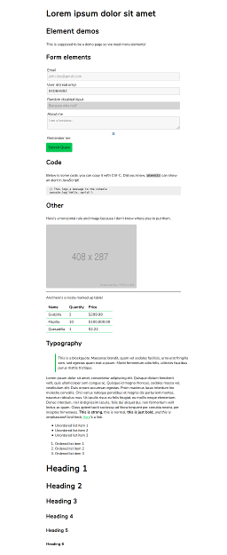](screenshot/attricss-0-brightlight-green.png)
[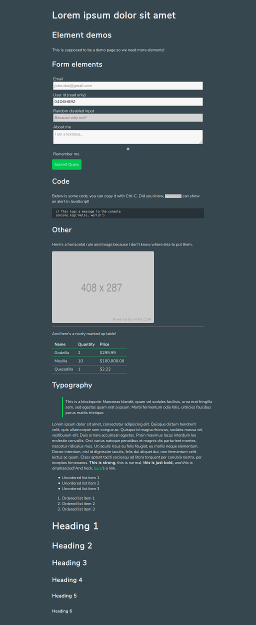](screenshot/attricss-1-midnight-green.png)
[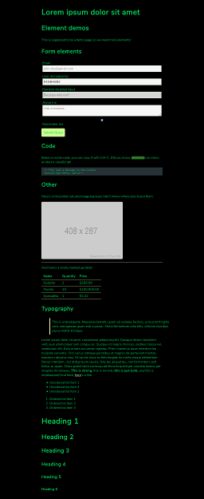](screenshot/attricss-2-darkforest-green.png)
[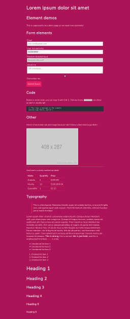](screenshot/attricss-3-darkfairy-pink.png)
[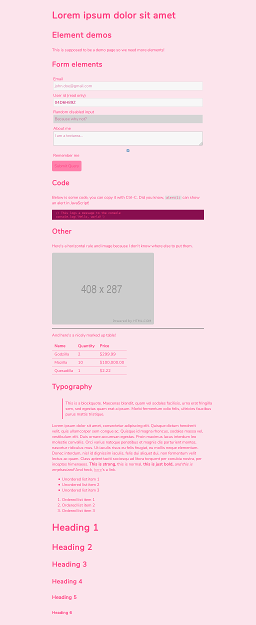](screenshot/attricss-4-lightfairy-pink.png)

## Bahunya

* [Repository](https://github.com/Kimeiga/bahunya)
* [Demo](https://kimeiga.github.io/bahunya/)

[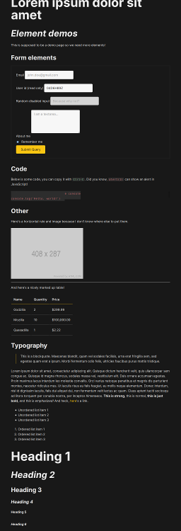](screenshot/bahunya.png)

## LatexCSS

* [Repository](https://github.com/oxalorg/sakura)
* [Demo](https://oxal.org/projects/sakura/demo/)

[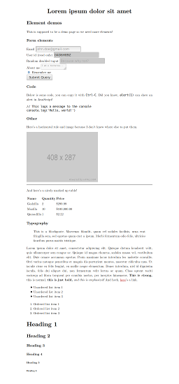](screenshot/latex.png)

## Milligram

Not fully classless.  You will at least need a `<section class="container">`.

* [Repository](https://github.com/milligram/milligram)
* [Demo](https://milligram.io/)

[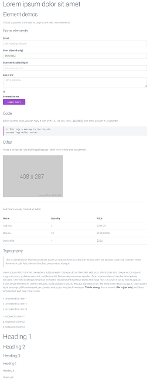](screenshot/milligram.png)

## sakura

* [Repository](https://github.com/oxalorg/sakura)
* [Demo](https://oxal.org/projects/sakura/demo/)

[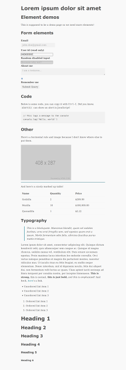](screenshot/sakura-normalize-0.png)
[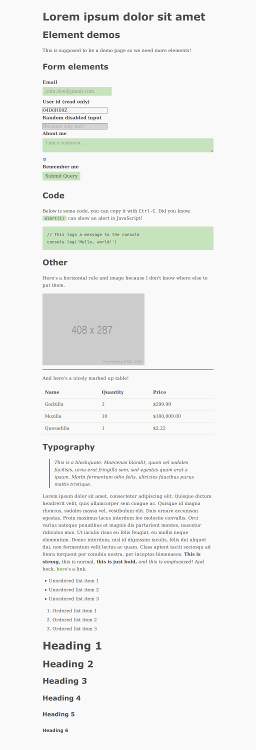](screenshot/sakura-normalize-1-earthly.png)
[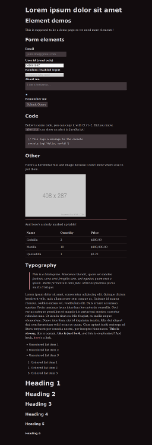](screenshot/sakura-normalize-2-vader.png)
[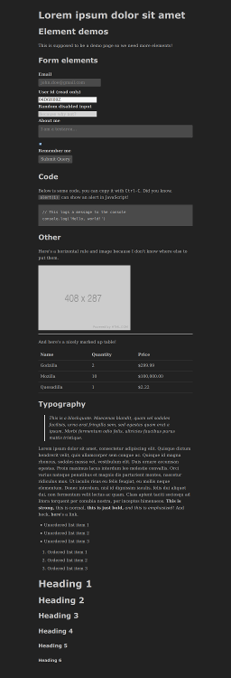](screenshot/sakura-normalize-3-dark.png)

## tacit

* [Repository](https://github.com/yegor256/tacit)
* [Demo](https://yegor256.github.io/tacit/)

[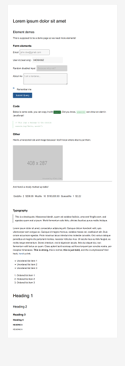](screenshot/tacit.png)

## W3C Core Styles

* [Website](https://www.w3.org/StyleSheets/Core/Overview)
* [Demo](https://www.w3.org/StyleSheets/Core/preview)

[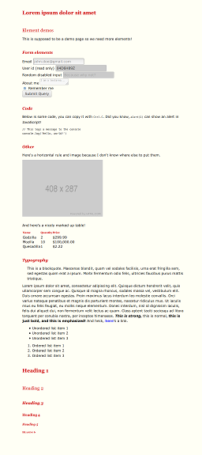](screenshot/w3c-core-styles-0-oldstyle.png)
[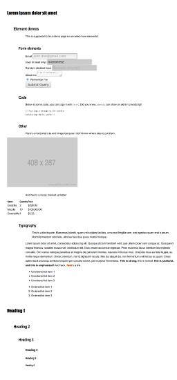](screenshot/w3c-core-styles-1-modernist.png)

[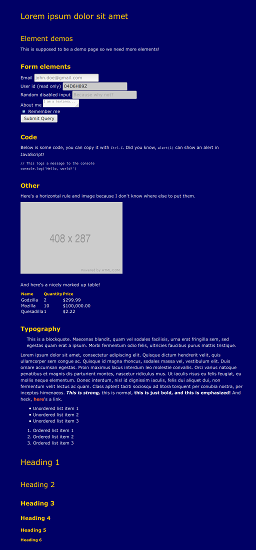](screenshot/w3c-core-styles-3-ultramarine.png)
[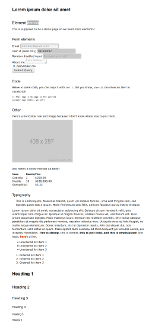](screenshot/w3c-core-styles-4-swiss.png)
[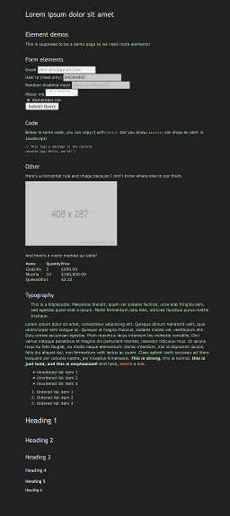](screenshot/w3c-core-styles-5-chocolate.png)
[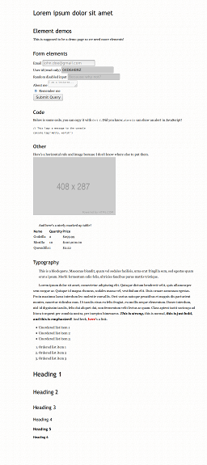](screenshot/w3c-core-styles-6-traditional.png)
[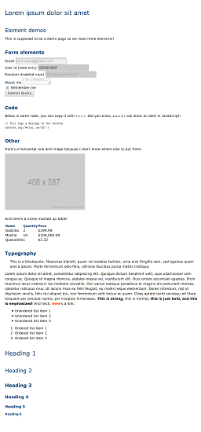](screenshot/w3c-core-styles-7-steely.png)

## water.css

* [Repository](https://github.com/kognise/water.css)
* [Demo](https://kognise.github.io/water.css/)

[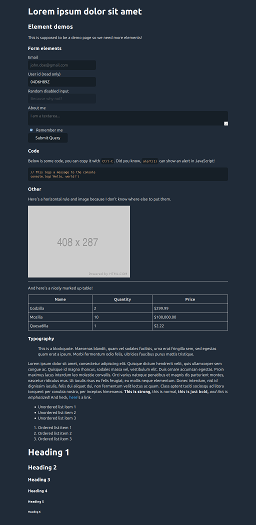](screenshot/water.css-0-dark.png)
[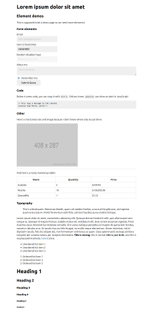](screenshot/water.css-1-light.png)

## License

To the extent possible under law, dbohdan has waived all copyright and related or neighboring rights to this work.
