# Classless CSS

This is a list of CSS themes and frameworks that do not require you to add their classes to your HTML elements.  It means you can quickly style a plain HTML page.  This is useful, for example, in prototyping.

## Contents

* [Classless](#classless)
  * [attriCSS](#attricss)
  * [awsm.css](#awsmcss)
  * [Bahunya](#bahunya)
  * [BareCSS](#barecss)
  * [LatexCSS](#latexcss)
  * [Markdown CSS](#markdown-css)
    * [Air](#air)
    * [Modest](#modest)
    * [Retro](#retro)
    * [Splendor](#splendor)
  * [Marx](#marx)
  * [sakura](#sakura)
  * [tacit](#tacit)
  * [Tufte CSS](#tufte-css)
  * [W3C Core Styles](#w3c-core-styles)
  * [water.css](#watercss)
  * [Writ](#writ)
  * [YoRHa](#yorha)
* [Class-light](#class-light)
  * [Milligram](#milligram)
  * [mini.css](#minicss)
  * [Picnic CSS](#picnic-css)
* [License](#license)

## Classless

### attriCSS

* [Repository](https://github.com/raj457036/attriCSS)
* [Demo](https://raj457036.github.io/attriCSS/)

### awsm.css

* [Repository](https://github.com/igoradamenko/awsm.css)
* [Demo](https://igoradamenko.github.io/awsm.css/elements.html)

[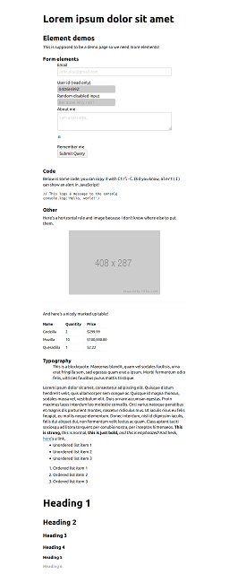](screenshot/awsm.css-0.png)
[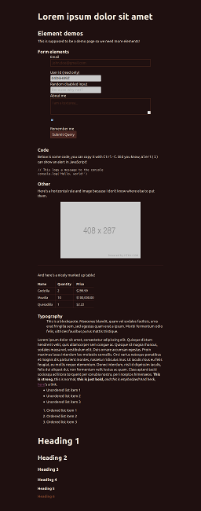](screenshot/awsm.css-1-gondola.png)
[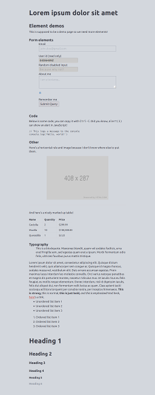](screenshot/awsm.css-2-mischka.png)
[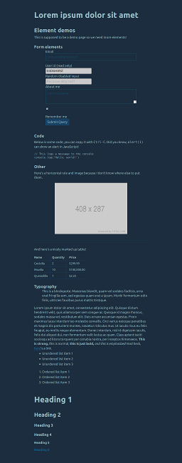](screenshot/awsm.css-3-big-stone.png)
[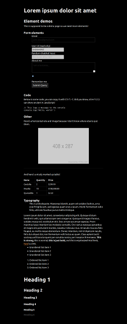](screenshot/awsm.css-4-black.png)
[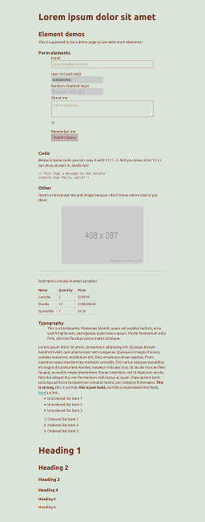](screenshot/awsm.css-5-tasman.png)
[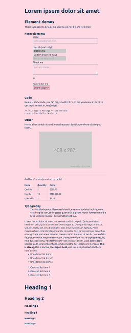](screenshot/awsm.css-6-pastel-pink.png)
[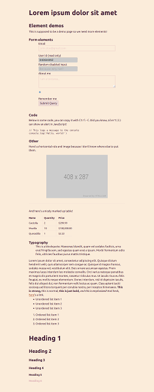](screenshot/awsm.css-7-pearl-lusta.png)

### Bahunya

* [Repository](https://github.com/Kimeiga/bahunya)
* [Demo](https://kimeiga.github.io/bahunya/)

### BareCSS

* [Repository](https://github.com/longsien/BareCSS)
* [Demo](http://barecss.com/)

### LatexCSS

* [Repository](https://github.com/davidrzs/latexcss)
* [Demo](https://davidrzs.github.io/latexcss/)

### Markdown CSS

#### Air

* [Repository](https://github.com/markdowncss/air)
* [Demo](https://markdowncss.github.io/air/)

[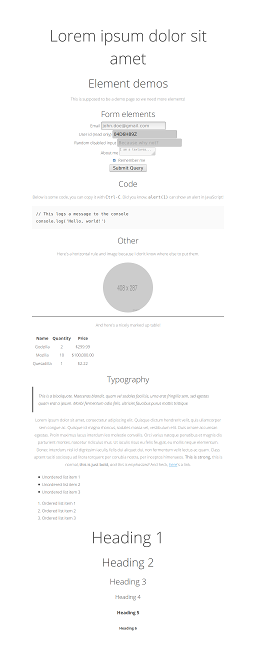](screenshot/markdowncss-air.png)

#### Modest

* [Repository](https://github.com/markdowncss/modest)
* [Demo](https://markdowncss.github.io/modest/)

[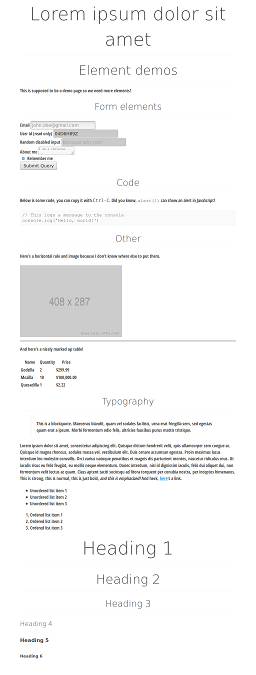](screenshot/markdowncss-modest.png)

#### Retro

* [Repository](https://github.com/markdowncss/retro)
* [Demo](https://markdowncss.github.io/retro/)

[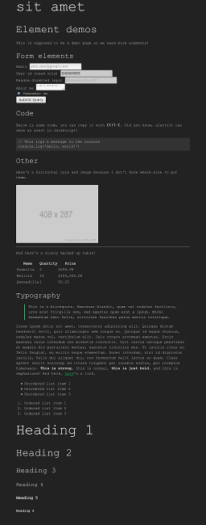](screenshot/markdowncss-retro.png)

#### Splendor

* [Repository](https://github.com/markdowncss/splendor)
* [Demo](https://markdowncss.github.io/splendor/)

[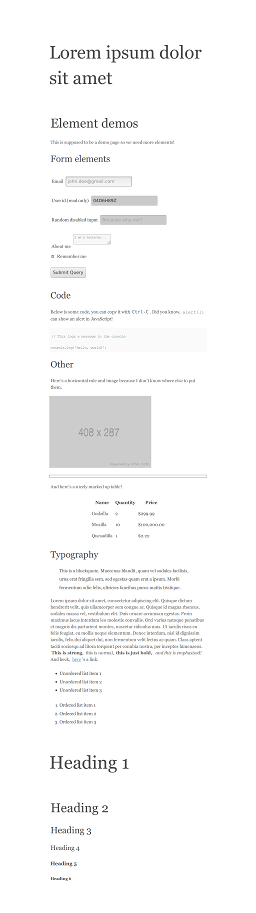](screenshot/markdowncss-splendor.png)

### Marx

* [Repository](https://github.com/mblode/marx)
* [Demo](https://codepen.io/mblode/details/JdYbJj)

[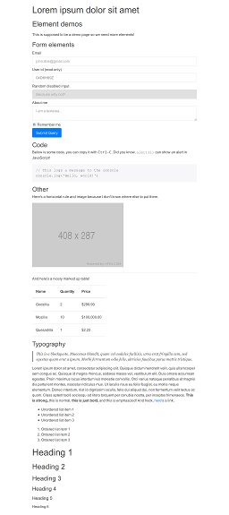](screenshot/marx.png)

### sakura

* [Repository](https://github.com/oxalorg/sakura)
* [Demo](https://oxal.org/projects/sakura/demo/)

### tacit

* [Repository](https://github.com/yegor256/tacit)
* [Demo](https://yegor256.github.io/tacit/)

### Tufte CSS

* [Repository](https://github.com/edwardtufte/tufte-css)
* [Demo](https://edwardtufte.github.io/tufte-css/)

[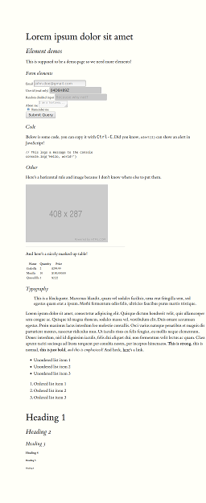](screenshot/tufte-css.png)

### W3C Core Styles

* [Website](https://www.w3.org/StyleSheets/Core/Overview)
* [Demo](https://www.w3.org/StyleSheets/Core/preview)

### water.css

* [Repository](https://github.com/kognise/water.css)
* [Demo](https://kognise.github.io/water.css/)

### Writ

* [Repository](https://github.com/programble/writ)
* [Demo](https://writ.cmcenroe.me/)

[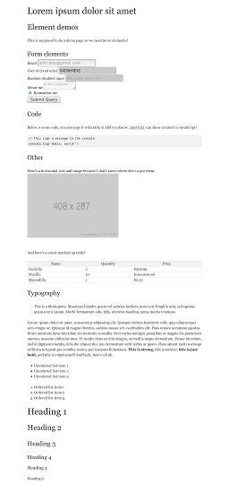](screenshot/writ.png)

### YoRHa

* [Repository](https://github.com/metakirby5/yorha)
* [Demo](https://metakirby5.github.io/yorha/)

[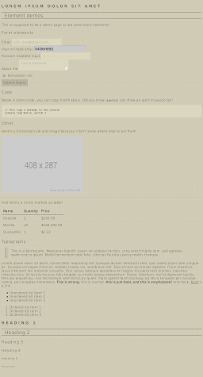](screenshot/yorha.png)

## Class-light

These are frameworks that do not force you to apply their classes to many elements but require something like `
` or a bit of your own CSS for a page to look right.  They may offer optional classes to style your content.

### Milligram

* [Repository](https://github.com/milligram/milligram)
* [Demo](https://milligram.io/)

### mini.css

* [Repository](https://github.com/Chalarangelo/mini.css)
* [Demo](https://minicss.org/docs)

[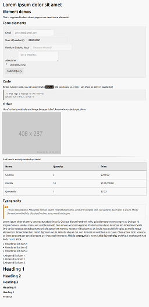](screenshot/minicss.png)

### Picnic CSS

* [Repository](https://github.com/franciscop/picnic)
* [Demo](http://picnicss.com/)

[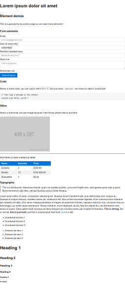](screenshot/picnic.png)

## License

To the extent possible under law, dbohdan has waived all copyright and related or neighboring rights to this work.
