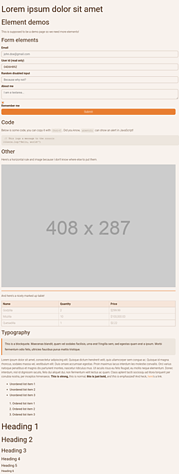
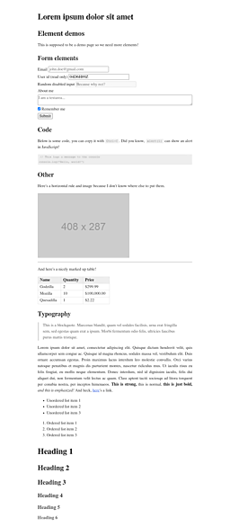
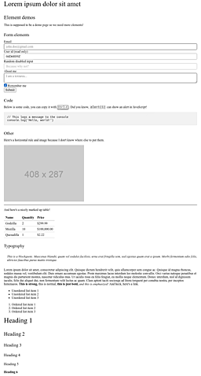

# Classless CSS

This is a list of classless CSS themes and frameworks.  "Classless" means a style sheet does not define special classes you must add to your HTML elements to style these elements.  As a result, you can style any plain-HTML page just by linking to the style sheet.  This is useful, for example, in prototyping.

## Contents

- [Classless CSS](#classless-css)
  * [Classless](#classless)
    + [Almond.CSS](#almondcss)
    + [attriCSS](#attricss)
    + [awsm.css](#awsmcss)
    + [axist](#axist)
    + [Bahunya](#bahunya)
    + [Bamboo CSS](#bamboo-css)
    + [BareCSS](#barecss)
    + [Basic.css](#basiccss)
    + [Bolt.css](#boltcss)
    + [ChimeraCSS](#chimeracss)
    + [Classless.css](#classlesscss)
    + [concrete.css](#concretecss)
    + [Downstyler](#downstyler)
    + [holiday.css](#holidaycss)
    + [LatexCSS](#latexcss)
    + [magick.css](#magickcss)
    + [Markdown CSS — Air](#markdown-css--air)
    + [Markdown CSS — Modest](#markdown-css--modest)
    + [Markdown CSS — Retro](#markdown-css--retro)
    + [Markdown CSS — Splendor](#markdown-css--splendor)
    + [Marx](#marx)
    + [MercuryCSS](#mercurycss)
    + [MVP.css](#mvpcss)
    + [new.css](#newcss)
    + [no-class.css](#no-classcss)
    + [Pico.css](#picocss)
    + [ridge.css](#ridgecss)
    + [sakura](#sakura)
    + [Simple.css](#simplecss)
    + [SPCSS](#spcss)
    + [style.css](#stylecss)
    + [Stylize.css](#stylizecss)
    + [tacit](#tacit)
    + [Tiny.css](#tinycss)
    + [tty.css](#ttycss)
    + [Tufte CSS](#tufte-css)
    + [W3C Core Styles](#w3c-core-styles)
    + [water.css](#watercss)
    + [Writ](#writ)
    + [YoRHa](#yorha)
  * [Class-light](#class-light)
    + [Barrel.css](#barrelcss)
    + [Chota](#chota)
    + [Fylgja](#fylgja)
    + [matcha.css](#matchacss)
    + [Milligram](#milligram)
    + [mini.css](#minicss)
    + [mono](#mono)
    + [Picnic CSS](#picnic-css)
    + [SASS-ZERO (Breadboard)](#sass-zero-breadboard)
    + [Wing](#wing)
  * [See also](#see-also)
  * [License](#license)

## Classless

### Almond.CSS

- [Repository](https://github.com/alvaromontoro/almond.css)
  
  
  
  
  
- [Demo](https://alvaromontoro.github.io/almond.css/demo/)

### attriCSS

- [Repository](https://github.com/raj457036/attriCSS)
  
  
  
  
  
- [Demo](https://raj457036.github.io/attriCSS/)

### awsm.css

- [Website](https://igoradamenko.com/awsm.css/v2/)
- [Demo](https://igoradamenko.com/awsm.css/v2/elements.html)

### axist

- [Repository](https://github.com/ruanmartinelli/axist)
  
  
  
  
  
- [Demo](https://ruanmartinelli.github.io/axist/)

### Bahunya

- [Repository](https://github.com/Kimeiga/bahunya)
  
  
  
  
  
- [Demo](https://kimeiga.github.io/bahunya/)

### Bamboo CSS

- [Repository](https://github.com/rilwis/bamboo)
  
  
  
  
  
- [Demo](https://rilwis.github.io/bamboo/demo/)

### BareCSS

- [Repository](https://github.com/longsien/BareCSS)
  
  
  
  
  
- [Demo](https://web.archive.org/web/20191010034508/http://barecss.com/)

### Basic.css

- [Repository](https://github.com/vladocar/Basic.css)
  
  
  
  
  
- [Demo](https://vladocar.github.io/Basic.css/)

### Bolt.css

- [Repository](https://github.com/tbolt/boltcss)
  
  
  
  
  
- [Demo](https://boltcss.com/)

### ChimeraCSS

- [Repository](https://github.com/ChimeraCSS/ChimeraCSS)
  
  
  
  
  
- [Demo](https://chimera-demo.vercel.app/)

### Classless.css

- [Repository](https://github.com/emareg/classlesscss)
  
  
  
  
  
- [Demo](http://classless.de/)

### concrete.css

- [Repository](https://github.com/louismerlin/concrete.css)
  
  
  
  
  
- [Demo](https://concrete.style/)

### Downstyler

- [Repository](https://github.com/waldyrious/downstyler)
  
  
  
  
  
- [Demo](https://waldyrious.github.io/downstyler)

### holiday.css

- [Repository](https://github.com/EvgenyOrekhov/holiday.css)
  
  
  
  
  
- [Demo](https://holidaycss.js.org/)

### LatexCSS

- [Repository](https://github.com/davidrzs/latexcss)
  
  
  
  
  
- [Demo](https://davidrzs.github.io/latexcss/)

### magick.css

- [Repository](https://github.com/wintermute-cell/magick.css)
  
  
  
  
  
- [Demo](https://css.winterveil.net/)

### Markdown CSS — Air

- [Repository](https://github.com/markdowncss/air)
  
  
  
  
  
- [Demo](https://markdowncss.github.io/air/)

### Markdown CSS — Modest

- [Repository](https://github.com/markdowncss/modest)
  
  
  
  
  
- [Demo](https://markdowncss.github.io/modest/)

### Markdown CSS — Retro

- [Repository](https://github.com/markdowncss/retro)
  
  
  
  
  
- [Demo](https://markdowncss.github.io/retro/)

### Markdown CSS — Splendor

- [Repository](https://github.com/markdowncss/splendor)
  
  
  
  
  
- [Demo](https://markdowncss.github.io/splendor/)

### Marx

- [Repository](https://github.com/mblode/marx)
  
  
  
  
  
- [Demo](https://codepen.io/mblode/details/JdYbJj)

### MercuryCSS

- [Repository](https://github.com/wmeredith/MercuryCSS)
  
  
  
  
  
- [Demo](https://wmeredith.github.io/MercuryCSS/)

### MVP.css

- [Repository](https://github.com/andybrewer/mvp)
  
  
  
  
  
- [Demo](https://andybrewer.github.io/mvp/)

### new.css

- [Repository](https://github.com/xz/new.css)
  
  
  
  
  
- [Demo](https://newcss.net/demo/)

### no-class.css

- [Repository](https://github.com/davidpaulsson/no-class)
  
  
  
  
  
- [Demo](https://davidpaulsson.se/no-class/)

### Pico.css

- [Repository](https://github.com/picocss/pico)
  
  
  
  
  
- [Demo](https://picocss.com/examples/preview/)

### ridge.css

- [Repository](https://github.com/swlkr/ridgecss)
  
  
  
  
  
- [Demo](https://ridgecss.com/)

### sakura

- [Repository](https://github.com/oxalorg/sakura)
  
  
  
  
  
- [Demo](https://oxal.org/projects/sakura/demo/)

### Simple.css

- [Repository](https://github.com/kevquirk/simple.css)
  
  
  
  
  
- [Demo](https://simplecss.org/demo)

### SPCSS

- [Repository](https://github.com/susam/spcss)
  
  
  
  
  
- [Demo](https://susam.github.io/spcss/)

### style.css

- [Repository](https://github.com/css-pkg/style.css)
  
  
  
  
  
- [Demo](https://css-pkg.github.io/style.css/)

### Stylize.css

- [Repository](https://github.com/vasanthv/stylize.css)
  
  
  
  
  
- [Demo](https://vasanthv.github.io/stylize.css/demo.html)

### tacit

- [Repository](https://github.com/yegor256/tacit)
  
  
  
  
  
- [Demo](https://yegor256.github.io/tacit/)

### Tiny.css

- [Repository](https://github.com/ihsan6133/tiny.css)
  
  
  
  
  
- [Demo](https://ihsan6133.github.io/tinycss)

### tty.css

- [Repository](https://github.com/piranna/tty.css)
  
  
  
  
  
- [Demo](https://piranna.github.io/tty.css/)

### Tufte CSS

- [Repository](https://github.com/edwardtufte/tufte-css)
  
  
  
  
  
- [Demo](https://edwardtufte.github.io/tufte-css/)

### W3C Core Styles

- [Website](https://www.w3.org/StyleSheets/Core/Overview)
- [Demo](https://www.w3.org/StyleSheets/Core/preview)

### water.css

- [Repository](https://github.com/kognise/water.css)
  
  
  
  
  
- [Demo](https://kognise.github.io/water.css/)

### Writ

- [Repository](https://github.com/programble/writ)
  
  
  
  
  
- [Demo](https://writ.cmcenroe.me/)

### YoRHa

- [Repository](https://github.com/metakirby5/yorha)
  
  
  
  
  
- [Demo](https://metakirby5.github.io/yorha/)

## Class-light

These are frameworks that do not force you to apply their classes to many elements but require something like `
` or a bit of your own CSS for a page to look right.  They may offer optional classes to style your content.

### Barrel.css

- [Repository](https://github.com/EternityForest/barrel.css)
  
  
  
  
  
- [Demo](https://eternityforest.github.io/barrel.css/)

### Chota

- [Repository](https://github.com/jenil/chota)
  
  
  
  
  
- [Demo](https://jenil.github.io/chota/)

### Fylgja

[Classless setup guide](https://fylgja.dev/guides/classless-setup/).

- [Website](https://fylgja.dev/features/native-styles/)
- [Repository](https://github.com/fylgja/fylgja)
  
  
  
  
  
- [Demo](https://codepen.io/Fylgja/pen/ExGOZaE)

### matcha.css

- [Repository](https://github.com/lowlighter/matcha)
  
  
  
  
  
- [Demo](https://matcha.mizu.sh/)

### Milligram

- [Repository](https://github.com/milligram/milligram)
  
  
  
  
  
- [Demo](https://milligram.io/)

### mini.css

- [Repository](https://github.com/Chalarangelo/mini.css)
  
  
  
  
  
- [Demo](https://minicss.org/docs)

### mono

- [Repository](https://github.com/artalar/mono)
  
  
  
  
  
- [Demo](https://monocss.vercel.app/)

### Picnic CSS

Caution: Picnic CSS requires specific HTML structure to display certain elements. For example, it hides vanilla checkboxes and radio buttons. The structure serves as the effective class of the element. This means an existing project will have to modify its HTML markup for, e.g., every checkbox and radio button to start using Picnic.

- [Repository](https://github.com/franciscop/picnic)
  
  
  
  
  
- [Demo](http://picnicss.com/)

### SASS-ZERO (Breadboard)

A class-light variant of a CSS framework with classes. Made for Ruby on Rails.

- [Repository](https://github.com/lazaronixon/sass-zero)
  
  
  
  
  

### Wing

- [Repository](https://github.com/kbrsh/wing)
  
  
  
  
  
- [Demo](https://kbrsh.github.io/wing/)

## See also

- [Drop-in switcher for previewing minimal CSS frameworks](https://github.com/dohliam/dropin-minimal-css)

## License

To the extent possible under law, D. Bohdan has waived all copyright and related or neighboring rights to this work. By contributing, you agree to release your contribution under the same terms.
